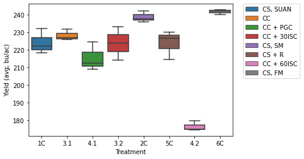

**Importing the data**
~~~
yield_data = pd.read_excel("2021 Yield.xlsx")
yield_data.head()
~~~

**Visualizing the data**

~~~
ax = sns.boxplot(x = "Treatment", y = "Yield (avg; bu/ac)", data = yield_data)
plt.savefig('all_yield_box.png')
~~~

I realized it doesn't work to have all the yields on the same plots because some treatments are soybeans and others are corn, so yields are very different.

**Subsetting the data**
~~~
corn_only = yield_data[yield_data['Treatment'].str.contains('1C|2C|3.1|3.2|4.1|4.2|5C|6C')]
corn_only.head()
~~~

And here is the same code yet again but with line numbers:


var foo = function(x) {
  return(x + 5);
}
foo(3)


## Boxes
You can add notification, warning and error boxes like this:

### Notification

{: .box-note}
**Note:** This is a notification box.

### Warning

{: .box-warning}
**Warning:** This is a warning box.

### Error

{: .box-error}
**Error:** This is an error box.
